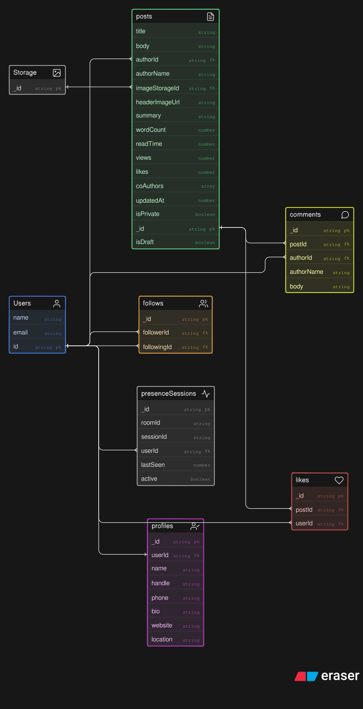
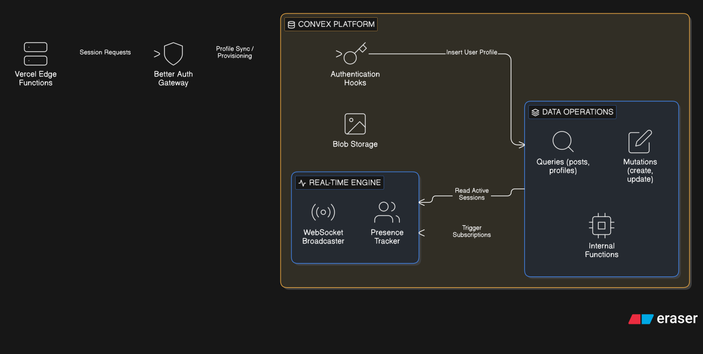
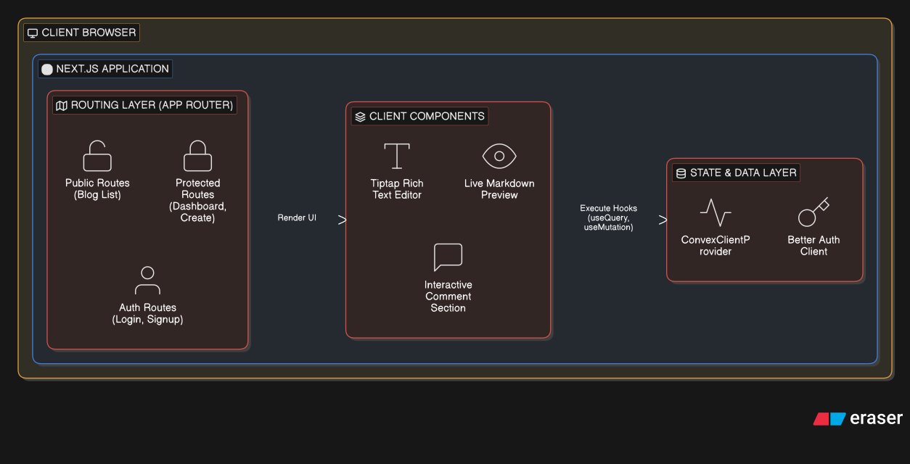

# MutexBlog

A modern, full-stack blogging platform built with Next.js, Convex, and Better Auth — designed for rich content creation, real-time interaction, and a seamless reading experience.

**Live Demo:** [nextblog-ov87.vercel.app](https://nextblog-ov87.vercel.app)

---

## Overview

MutexBlog is a full-stack blog application that enables users to create, edit, and publish articles using a powerful rich text editor. It focuses on developer-friendly architecture, real-time data synchronization, modular UI components, and scalable design.

The project integrates modern frontend technologies with Convex as a reactive backend, making it suitable for personal blogs, technical writing platforms, or content-driven applications requiring live updates.

---

## Features

- **Rich Text Editor** powered by Tiptap (v3) with Markdown support
- **Syntax Highlighting** for code blocks via highlight.js and lowlight
- **Real-Time Updates** — live presence sessions, instant comment/like updates via Convex
- **Authentication** via Better Auth + `@convex-dev/better-auth`
- **User Profiles** with customizable bios, handles, and follower/following mechanics
- **Full-Text Search** indexing for blog discovery
- **Image Embeds** and YouTube video support in the editor
- **Dark Mode** support via `next-themes`
- **Modular UI** built on Shadcn UI + Radix UI + Tailwind CSS
- **TypeScript** throughout for end-to-end type safety

---

## Tech Stack

| Layer | Technology |
|---|---|
| Frontend | Next.js 16, React 19, TypeScript |
| Backend | Convex (real-time database & serverless functions) |
| Auth | Better Auth (`@convex-dev/better-auth`) |
| Editor | Tiptap v3 + `tiptap-markdown` |
| Styling | Tailwind CSS v4, Shadcn UI, Radix UI |
| Presence | `@convex-dev/presence` |
| Icons | Lucide React |
| Forms | React Hook Form + Zod |
| Notifications | Sonner |
| Syntax | highlight.js + lowlight |

---

## Project Structure

```
/app
  /blog
    /[slug]
      page.tsx          → Individual blog page
  /editor
    page.tsx            → Blog editor interface

/components
  /ui                   → Shadcn UI components (tabs, input, label, etc.)
  /blog
    EditorToolbar.tsx   → Editor formatting toolbar
    Editor.tsx          → Tiptap editor wrapper

/convex                 → Convex backend (schema, queries, mutations, auth)

/lib
  utils.ts              → Utility functions (cn, etc.)

/public                 → Static assets

proxy.ts                → Convex proxy configuration
sampleData.jsonl        → Seed data for development
```

---

## How It Works

**Editor Layer:** Uses Tiptap v3 extensions for rich text editing — supports formatting, links, code blocks with syntax highlighting, images, and YouTube embeds.

**Backend (Convex):** All data (posts, users, comments, likes, followers) is stored in Convex's reactive database. Functions run server-side as queries and mutations, and the client subscribes to real-time updates automatically.

**Authentication:** Better Auth handles session management and user identity, integrated with Convex via `@convex-dev/better-auth`.

**Rendering:** Next.js App Router handles all routing. Dynamic routes (`/blog/[slug]`) render individual posts. Real-time presence is tracked per session using `@convex-dev/presence`.

**UI Layer:** Reusable Shadcn UI components ensure consistency. Dark mode is managed via `next-themes`.

---

## Installation

1. Clone the repository:
   ```bash
   git clone https://github.com/Kaushikmak/nextblog
   cd nextblog
   ```

2. Install dependencies (pnpm recommended):
   ```bash
   pnpm install
   ```

3. Configure environment variables — create a `.env.local` file:
   ```env
   NEXT_PUBLIC_CONVEX_URL=your_convex_deployment_url
   NEXT_PUBLIC_CONVEX_SITE_URL=your_convex_site_url
   ```

4. Start the Convex dev backend:
   ```bash
   npx convex dev
   ```

5. Run the development server:
   ```bash
   pnpm dev
   ```

6. Open in browser: [http://localhost:3000](http://localhost:3000)

---

## ARCHITECTURE

###### SCHEMA

###### SERVER

###### NEXT APP



## Deployment

### Backend (Convex)

Convex functions and the database are deployed automatically via:
```bash
npx convex deploy
```

### Frontend (Vercel)

1. Push your code to GitHub.
2. Import the project into [Vercel](https://vercel.com).
3. Add environment variables in the Vercel dashboard:
   - `NEXT_PUBLIC_CONVEX_URL`
   - `NEXT_PUBLIC_CONVEX_SITE_URL`
4. Vercel will auto-detect Next.js and deploy.

The build command (`pnpm build`) runs `npx convex deploy && next build` to ensure the backend is deployed before the frontend builds.

---

## Known Issues

- Potential duplicate Tiptap extension registrations (e.g., `link`, `codeBlock`) — verify extension config in `Editor.tsx`
- `@types/highlight.js` is a dev dependency but `highlight.js` v11+ ships its own types — this dep can be removed
- The `add` and `tabs` packages in `dependencies` appear to be accidental installs and are likely unused
- `shadcn-ui` in `dependencies` should only be in `devDependencies` (it's a CLI tool, not a runtime dependency)
- Module resolution with pnpm may require `shamefully-hoist=true` in `.npmrc` for some packages
- UI component path aliases (`@/components/ui`) require `tsconfig.json` path configuration to be correct

---

## Future Improvements

- SEO optimization (metadata, Open Graph tags, sitemap)
- Server-side rendering for blog content (currently client-rendered)
- Image uploads and media handling (CDN integration)
- Comment system UI
- Notifications for follows, likes, and comments
- RSS feed
- Draft / scheduled post support
- Admin dashboard for content moderation

---

## Environment Variables Reference

| Variable | Description |
|---|---|
| `NEXT_PUBLIC_CONVEX_URL` | Your Convex deployment URL |
| `NEXT_PUBLIC_CONVEX_SITE_URL` | Your Convex site URL (for auth callbacks) |

---

## License

This project is open-source and available for modification and distribution.

--- 

## Author

**Kaushik** — [github.com/Kaushikmak](https://github.com/Kaushikmak)

---

> **Note:** The GitHub repository is named `nextblog` cuz' I was dumb, but the application is officially branded as **MutexBlog**.